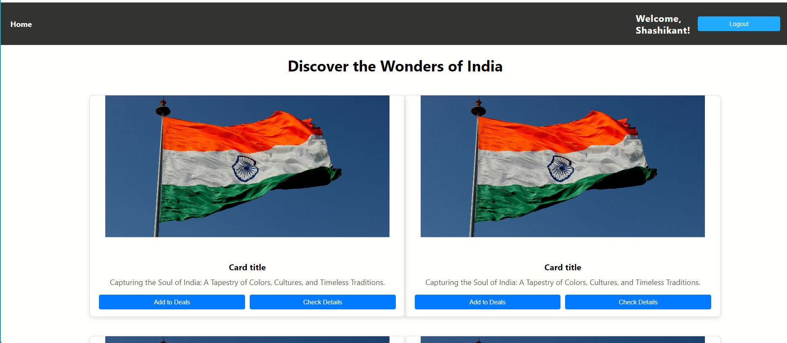

# React-UI


Welcome to the official repository of [Shashikant Rupin]. This React application serves various purposes, including providing a homepage, user authentication through the login route, and allowing new users to register via the register route.

## Routes

### Homepage
- **Route:** /
- **Description:** The homepage serves as the central hub of the application. It may contain essential information about the application, featured content, or a dashboard view.

### Login
- **Route:** /login
- **Description:** The login route facilitates user authentication. Users can input their credentials through a form to log in to the application.

### Register
- **Route:** /register
- **Description:** The register route enables new users to create an account within the application. It typically includes a form where users can provide their information to register.

## Screenshots

Include any relevant screenshots to showcase the UI of your application. For example:


## Usage

To start the development server and run the application, follow these steps:

1. Install dependencies:

```bash
npm install

2:npm run start
